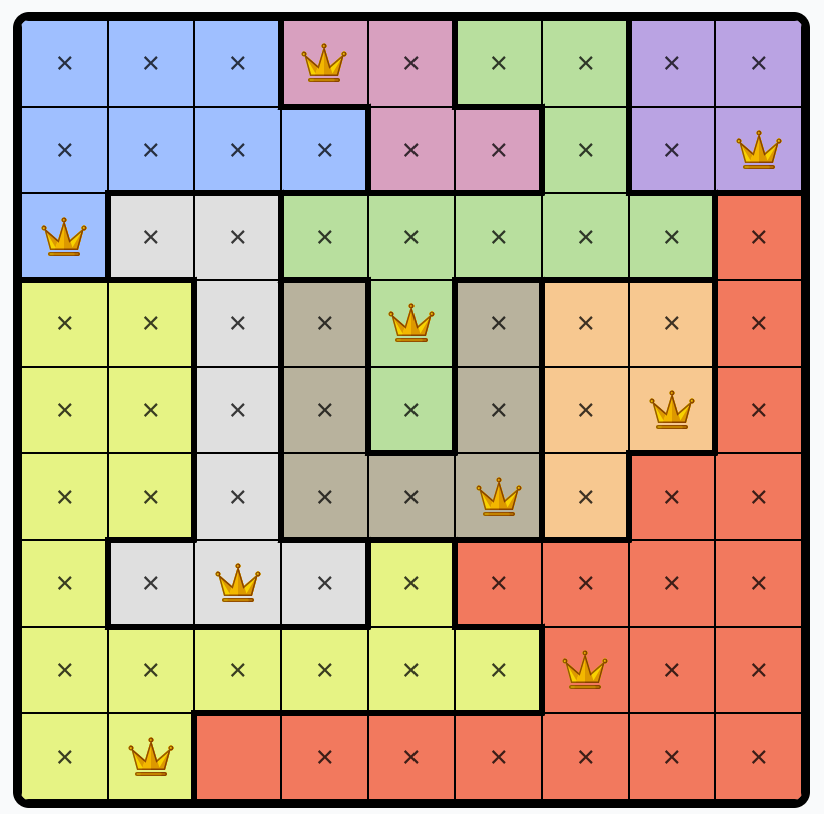

# Queens Game Solver

## Introduction

*Queens* is a puzzle game featured on LinkedIn.

The rules are simple: given a grid with:
- **K** rows and columns  
- **K** areas of different colors  

(where K ∈ ℕ),

the goal is to find a configuration such that:
- there is exactly **one queen per row**,
- exactly **one queen per column**,
- exactly **one queen per colored area**,
- and **no two queens must touch**.

Let's consider the following example grid:

<table>
<tr>
<td width="50%">

</td>
<td width="50%">

</td>
</tr>
</table>

There are 9 colors, 9 rows, and 9 columns.  
Trying to find the solution without any strategy or algorithm can be quite challenging.

However, by focusing on the first two rows, we can already deduce that the **blue** and **green** areas **cannot** contain a queen in those rows. Why? Because the **purple** and **pink** areas are only present there, so they must contain the queens for those rows.

This allows us to eliminate candidate cells from other areas.  
By repeating this logic step by step, we can eventually deduce the full solution (note: in the online interface, you can add black crosses to mark excluded cells by clicking once on them - helpful for tracking!).

---

## Hypothesis

The algorithm used to solve the puzzle relies on **basic logical reasoning**.  
The implementation assumes that the game is **"logically solvable"**, meaning no guessing or hypothesis is required: every deduction can be made through pure logic.

## Code 

